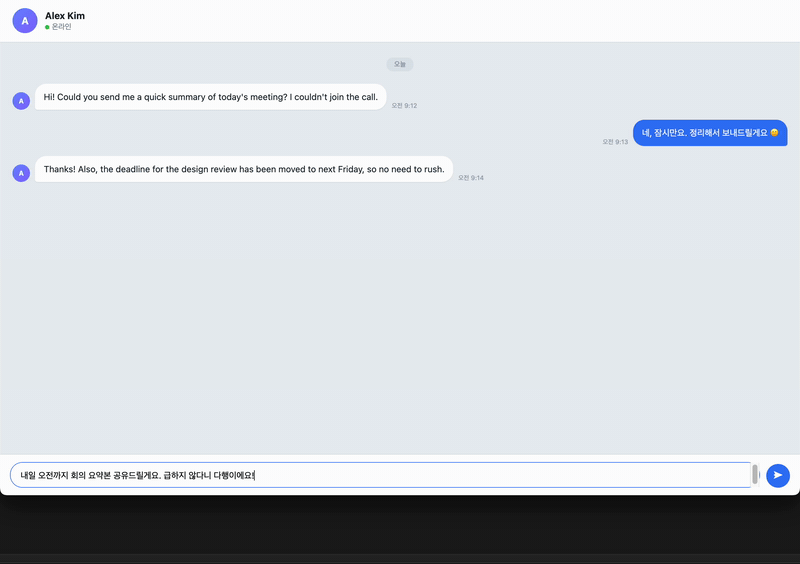
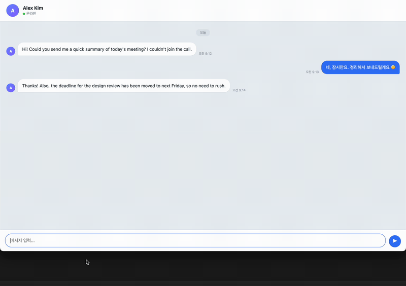
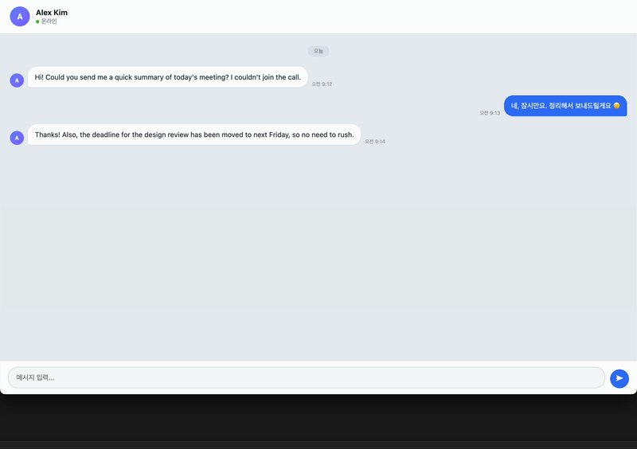
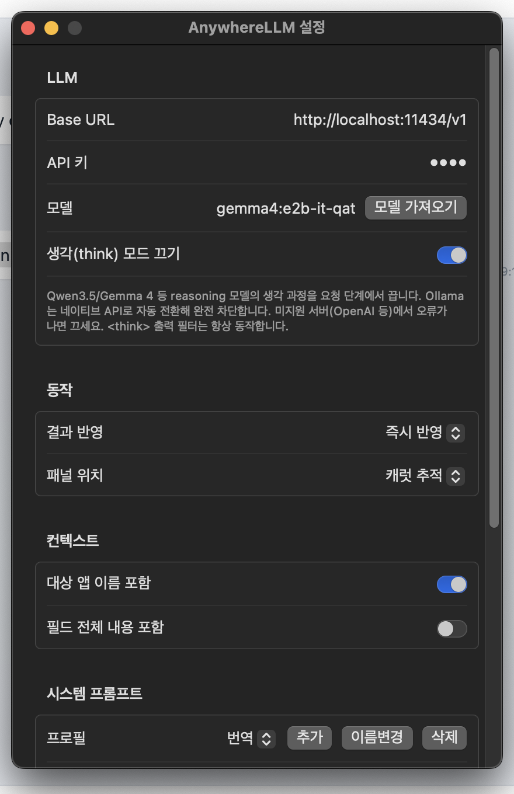

<div align="center">

[English](README.md) | **한국어**


# AnywhereLLM

**어떤 앱이든, 지금 커서가 있는 그 자리에서 LLM을.**

글로벌 핫키 <kbd>⌘⇧Space</kbd> 하나로 포커스를 뺏지 않는 패널을 띄우고,
LLM 응답을 포커스된 텍스트박스에 실시간 타이핑하거나 선택한 텍스트를 그 자리에서 교체합니다.


**[🌐 소개 페이지](https://scian0204.github.io/AnywhereLLM/)**



*메신저 입력창에 쓴 한국어 초안을 선택하고 <kbd>⌘⇧Space</kbd> → <kbd>⏎</kbd> — 번역 결과가 그 자리를 교체합니다.*

</div>

---

## 왜 만들었나

ChatGPT 창으로 갔다가, 복사하고, 돌아와서, 붙여넣는 왕복은 그만.
AnywhereLLM은 **대상 앱이 frontmost를 유지한 채로** 동작하는 비활성 패널(NSPanel)이라,
패널에 타이핑하는 동안에도 원래 앱의 포커스·커서·선택이 그대로 살아 있습니다.
결과는 클립보드를 건드리지 않고 키 이벤트 합성으로 그 자리에 흘려 넣습니다.

## 데모

### ✍️ 삽입 — 응답이 입력창에 실시간으로 타이핑

빈 입력창에 커서를 두고 패널에 요청을 입력하면, 응답이 도착하는 대로 대상 앱에 스트리밍 타이핑됩니다.



### 🔁 교체 — 선택한 텍스트를 결과로

텍스트를 선택한 채 호출하면 패널에서 원문과 결과를 확인하고, 완료 시 선택 영역이 자동 교체됩니다.
멀티턴 대화로 결과를 다듬은 뒤 반영할 수도 있습니다. *(위 히어로 GIF)*

### 👀 읽기 — 편집 불가 영역은 패널에서

상대방 메시지·웹 본문·PDF처럼 삽입할 곳이 없는 텍스트를 선택하면, 결과를 패널에 남겨 보여줍니다.



### 📸 스크린샷 — 영역을 캡쳐해 물어보기

캡쳐 핫키(기본 <kbd>⌘⇧2</kbd>)를 누르고 <kbd>⌘⇧4</kbd>처럼 화면 영역을 드래그로 선택하면, 캡쳐한 이미지와 함께 같은 패널이 떠서 비전 지원 모델에 그 이미지에 대해 질의할 수 있습니다.

## 주요 기능

- **포커스 무손실 패널** — `.nonactivatingPanel` 기반. 패널이 키 입력을 받아도 대상 앱이 frontmost 유지. 이 앱의 존재 이유.
- **글로벌 핫키** — 기본 <kbd>⌘⇧Space</kbd>, 설정에서 변경 가능. 스트리밍 중 재입력하면 취소.
- **스크린샷 질의** — 두 번째 글로벌 핫키(기본 <kbd>⌘⇧2</kbd>, 변경 가능)로 화면 영역을 드래그 캡쳐해 같은 패널에서 비전 지원 모델에 질의. macOS는 화면 기록 권한 필요.
- **3가지 UX 자동 분기** — 편집 가능성 × 선택 유무를 접근성(AX) API로 판정해 삽입 / 교체 / 보기 전용을 자동 선택.
- **클립보드 무접촉 쓰기** — AX 삽입 우선, 실패 시 유니코드 키 이벤트 합성 타이핑. 복사 버퍼를 더럽히지 않음.
- **OpenAI 호환 API** — chat completions SSE 스트리밍. Ollama·LM Studio·vLLM 등 로컬 서버 포함.
- **think 모드 처리** — reasoning 모델의 `<think>` 출력을 요청 단계에서 끄고, 출력 필터로 한 번 더 차단.
- **프롬프트 프로필** — 번역·요약·교정 등 용도별 시스템 프롬프트를 저장하고 패널에서 <kbd>⌘P</kbd>로 즉시 전환.
- **보안 우선** — 비밀번호 필드(보안 텍스트필드) 감지 시 캡처·삽입·클립보드 폴백 전부 차단(해제 불가). API 키는 키체인 저장.
- **의존성 0** — 외부 패키지 없이 AppKit + SwiftUI만 사용.

## 설치

### Homebrew (권장)

```bash
brew install --cask scian0204/tap/anywherellm
```

> **참고** — Apple 공증(notarization) 없이 자가서명으로 배포되는 앱이라, 설치 과정에서
> cask가 격리(quarantine) 속성을 자동 제거합니다. 그래도 "손상된 앱"으로 차단되면:
> ```bash
> xattr -dr com.apple.quarantine /Applications/AnywhereLLM.app
> ```

업데이트는 `brew upgrade --cask anywherellm`, 제거는 `brew uninstall --cask anywherellm`.

### 소스 빌드

```bash
git clone https://github.com/scian0204/AnywhereLLM.git
cd AnywhereLLM
make            # release 빌드 + build/AnywhereLLM.app 조립 + 서명
make run        # 빌드 후 실행
```

> **팁** — 재빌드해도 접근성 권한이 유지되도록 자가서명 인증서를 1회 생성해 두세요:
> ```bash
> scripts/make-signing-cert.sh
> ```
> 권한이 꼬였다면: `tccutil reset Accessibility kr.scian0204.AnywhereLLM`

### Windows

[Releases](https://github.com/scian0204/AnywhereLLM/releases)에서 `AnywhereLLM-<버전>-x64.msi`를
받아 더블클릭하면 됩니다 — 관리자 권한 없이 사용자 단위로 설치되고, 시작 메뉴 바로가기와
제거 항목이 추가됩니다. 직접 빌드하려면:

```powershell
cd windows
.\packaging\installer\build-installer.ps1   # → packaging/installer/AnywhereLLM-<버전>-x64.msi
```

Windows 빌드는 .NET 10 / WPF 트레이 앱입니다(기본 핫키 **Ctrl+Shift+Space**).
macOS와 달리 접근성 권한이 필요 없습니다. 상세: [windows/README.md](windows/README.md).

### 요구 사항

| | |
|---|---|
| OS | macOS 14 (Sonoma) 이상 — 또는 Windows 10/11 |
| 빌드 | Swift 6.0 툴체인 (Xcode Command Line Tools) |
| 권한 | 손쉬운 사용(Accessibility) — 첫 실행 시 안내 |
| LLM | OpenAI 호환 chat completions 엔드포인트 (로컬/원격) |

## 빠른 시작



1. 메뉴바 아이콘 → **설정** — Base URL·모델·API 키 입력
   (Ollama라면 `http://localhost:11434/v1` + **모델 가져오기** 클릭)
2. 아무 앱의 텍스트박스에 커서를 두고 <kbd>⌘⇧Space</kbd>
3. 요청 입력 → <kbd>⏎</kbd> — 응답이 그 자리에 타이핑됩니다
4. 텍스트를 **선택한 상태**로 호출하면 교체 모드 — 프로필이 지시를 대신하므로 빈 입력 <kbd>⏎</kbd>만으로도 전송
5. <kbd>⌘P</kbd> + <kbd>↑</kbd><kbd>↓</kbd>로 패널 안에서 프로필 전환, <kbd>Esc</kbd>로 닫기
6. <kbd>⌘⇧2</kbd>로 화면 영역을 캡쳐해 비전 지원 모델에 이미지에 대해 질의

<br clear="right">

## 동작 원리

```
⌘⇧Space ──▶ HotkeyManager (Carbon)
               │  패널 표시 전에 대상 컨텍스트 캡처 (순서 불변)
               ▼
        TextTargetService ── AX 우선, 클립보드 백업 ⌘C 폴백
               │  편집 가능성 × 선택 유무 판정
               ▼
         PromptPanel (.nonactivatingPanel — 대상 앱 frontmost 유지)
               │
               ▼
          LLMClient ── OpenAI 호환 SSE 스트리밍
               │
               ▼
     ThinkTagFilter ──▶ AX setSelectedText(반영 검증) 또는
                        CGEvent 유니코드 타이핑 (클립보드 무접촉)
```

| 구성 요소 | 책임 |
|---|---|
| `HotkeyManager` | Carbon 글로벌 핫키 등록/재로딩 |
| `AppDelegate` | 메뉴바, 접근성 권한 플로우, 핫키 → 패널 토글 |
| `TextTargetService` | 대상 앱 텍스트 I/O — AX 판정·읽기·검증 쓰기, Chromium 특례 처리 |
| `PromptPanel` | 포커스를 뺏지 않는 NSPanel + SwiftUI 호스팅 |
| `ConversationController/View` | 삽입/교체/보기 전용 UX 분기, 멀티턴 대화 |
| `LLMClient` | SSE 스트리밍 클라이언트 (`URLSession.bytes`) |
| `KeychainStore` | API 키 키체인 보관 |
| `LLMCore` (라이브러리) | SSE 파서·think 태그 필터·엔드포인트 URL 조합/origin 추출·Ollama 네이티브 NDJSON 파서 — 단위 테스트 대상 |

타겟은 2개입니다: 실행 파일 `AnywhereLLM`과, 테스트 가능한 순수 로직만 분리한 `LLMCore`.
설계 결정과 근거는 [docs/PLAN.md](docs/PLAN.md), 단계별 구현 기록(실측 노트 포함)은 [docs/progress/](docs/progress/)에 있습니다.

```bash
swift test      # LLMCore 단위 테스트 (SSEParser, ThinkTagFilter, Endpoint, OllamaChatParser)
```

## 보안에 대하여

- **보안 텍스트필드 전면 차단** — 비밀번호 입력란이 감지되면 캡처·삽입·클립보드 폴백이 모두 비활성화되며, 설정으로도 풀 수 없습니다.
- **API 키는 키체인에** — UserDefaults나 평문 파일에 저장하지 않습니다.
- **클립보드 무접촉** — 삽입은 키 이벤트 합성으로 이루어져 복사 버퍼가 오염되지 않습니다. (읽기 폴백이 클립보드를 쓰는 경우 원본을 백업/복원)

## 라이선스

[MIT](LICENSE)
